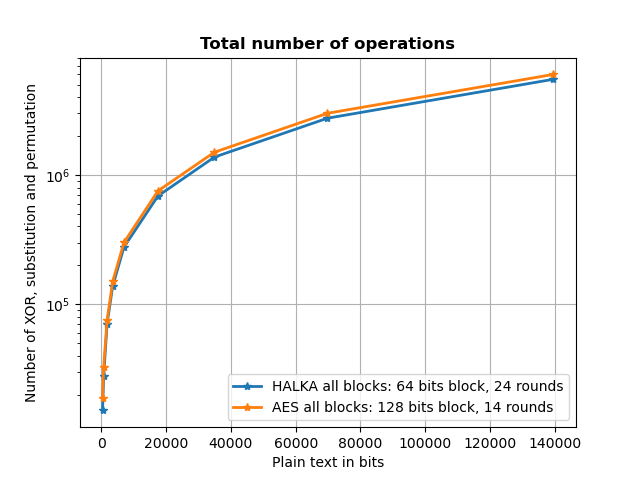
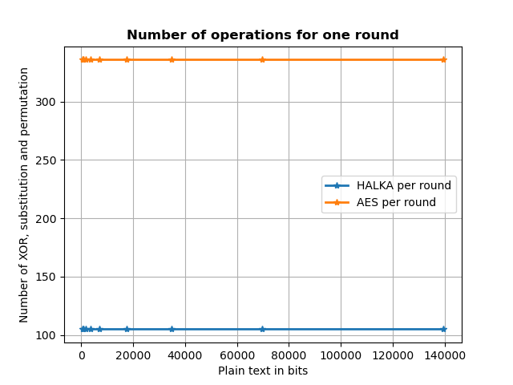

# **Blockchain final project. Lightweight cryptography.**

### **Abstract**

In this project we studied the work of well known ciphers like AES, PRESENT and HALKA. The motivation was proposed by the idea of lightweight cryptography. HALKA is a newly developed lightweight cipher which is suitable for usage on small devices. It has some patterns from AES as well as from PRESENT. While PRESENT is also a lightweight cipher, HALKA promises to have better performance in terms of operations complexity and number of operations. We demonstrated that HALKA is a lightweight cipher as it requires quite less number of operations per round compared to AES. Still, the total number of operations is similar due to the bigger block size of AES and less number of rounds.

### **Introduction.**

Encryption is an important part of any blockchain process nowadays. The diversity of devices we use on a regular basis makes encryption algorithms to be run on any device and still provide high security and fast computational operations. Thus, lightweight ciphers were developed. One of the commonly used ciphers involve block ciphers which are based on deterministic operations such as substitution and permutation (SP). Any such ciphers use several parameters like block size, SP descriptions, key size and number of rounds which can differ from algorithm to algorithm. Also, the logic of substitution, permutation and key expanding can differ which makes the algorithm more or less secure or lightweight. One of the recent algorithms which are currently in use can be AES (Advanced Encryption Standard), PRESENT, and Halka, which we will discuss further. The common idea for all these three algorithms is that they initially take a plaintext of predefined size and shape and XOR with the initial key bringing it to a new state and complete n rounds which depend on the algorithm. There is also a key generation procedure for all n rounds, and it can vary from algorithm to algorithm. In each round the state is firstly XORed with the corresponding key of that round, and substitution and permutation algorithms are applied.

### **Experiments**

We tried different sizes of the input plain text for both algorithms and calculated the number of XOR, substitution and permutation operations. We provide plots with a number of operations for all blocks and for one round.

### **Results**

On the plots below we can observe that in terms of one round HALKA is much lighter and requires less operations, but as far as AES uses much less number of blocks (because of 2 times bigger block size) and number of rounds, their total performance is quite similar.

### **References**

- Jena, Baivar Kumar, “What Is AES Encryption and How Does It Work?” Feb 9, 2023. 
https://www.simplilearn.com/tutorials/cryptography-tutorial/aes-encryption

- Braincoke, “The AES Key Schedule explained” Aug 1, 2021
https://braincoke.fr/blog/2020/08/the-aes-key-schedule-explained/#aes-in-summary

- Bogdanov, Andrey, et al. "PRESENT: An ultra-lightweight block cipher." Cryptographic Hardware and Embedded Systems-CHES 2007: 9th International Workshop, Vienna, Austria, September 10-13, 2007. Proceedings 9. Springer Berlin Heidelberg, 2007.
https://link.springer.com/chapter/10.1007/978-3-540-74735-2_31

- Das, Sourav. "Halka: a lightweight, software friendly block cipher using ultra-lightweight 8-bit S-box." Cryptology ePrint Archive (2014).
https://eprint.iacr.org/2014/110

## **Project structure**

**aes.py** - contains functionality for running AES algorithm

**halka.py** - contains functionality for running HALKA algorithm

**utils.py** - contains functionality on different bits operations

**main.py** - contains functionality on test run of AES or HALKA

**main.py** - contains functionality on running AES and HALKA with different plain text sizes and plots generation

## **Launch**

To obtain plots with results: *python3 main_plots.py*
